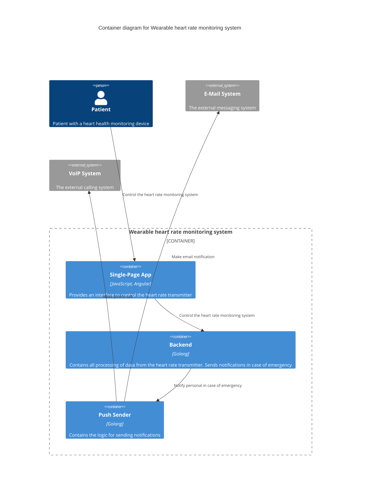
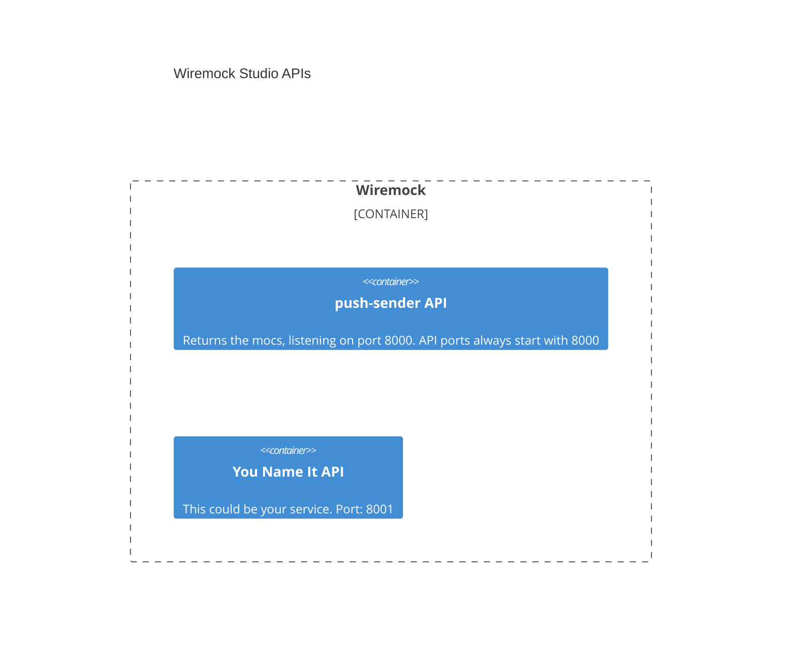

## Overview

To make it easier to understand, let's take a simplified description of 
a cardiac health monitoring system.

### Diagram
Let's have a look at the diagram and move on to the practical part.




### Usecase

The ```Wearable``` service monitors the patient's cardiac health
and notifies the staff in case of an emergency .

Let's pretend that we need to develop a ```Wearable``` service.

In that case, we probably want to disable sending messages to real
notification systems for the time of development and debugging.
To do this, we can run mock service instead of the ```push-sender``` service.

The ```grpc-wiremock``` will do this job just fine. Here is a step-by-step tutorial.

## Hands-on
All you need is ~~love~~ set of **openapi** or **proto** contracts.

### Contracts

#### Wearable

```protobuf
...

service WearableService {
  rpc BeatsPerMinute(BeatsPerMinuteRequest) 
      returns (stream BeatsPerMinuteResponse);
}
```

#### push-sender

```protobuf
...

service PushSender {
  rpc Notify(NotifyRequest) returns (NotifyResponse);
}
```

### Before run

To run ```grpc-wiremock```, you need to prepare three directories:

- path to the folder with the service-dependency contracts;
    ```
    deps
    └── services
        └── push-sender
            └── grpc
                └── push-sender.proto
    ```
- path to the directory for Wiremock config and mappings (can be empty);
  ```
  test/wiremock
  ```
- path to the directory for generated certificates. For example:
  ```
  /tmp/certs
  ```
  
### Run

Execute the folowing command in your console to start the ```grpc-wiremock```:
```bash
MOCKS_PATH="$(PWD)/test/wiremock"

CERTS_PATH="/tmp/certs"

CONTRACTS_PATH="deps"

docker run \
  -p 9000:9000 \
  -p 8000:8000 \
  -v ${MOCKS_PATH}:/home/mock \
  -v ${CERTS_PATH}:/etc/ssl/mock/share \
  -v ${CONTRACTS_PATH}:/proto \
  SberMarket-Tech/grpc-wiremock@latest
```

You can also run services using ```docker compose```. 
Check out [compose](build/docker-compose.yaml) file. 

```bash
make up
```

### After run

Let's see what happened after running ```grpc-wiremock```:
- you got generated certificates to test with secured connection:
  ```json
  /tmp/certs/
  ├── mockCA.crt
  ├── mockCA.key
  └── mockCA.srl
  ```

- ```test/wiremock``` directory looks like this:
  ```
  test/wiremock
  ├── push-sender
  │   ├── __files
  │   └── mappings
  │       └── pushsender_notify_post_200.json
  └── services.json
  ```
  
- Wiremock config ```service.json```:
  ```json
  {
    "services" : [ {
      ...
      
      "name" : "push-sender",
      "port" : 8000,
    } ]
  }
  ```
- and generated mock for your ```Notify``` method from [push-sender.proto](deps/services/push-sender/grpc/push-sender.proto):
  ```json
  {
    ...
    
    "request" : {
      "urlPath" : "/Pushsender/Notify",
      "method" : "POST"
    },
    "response" : {
      "status" : 200,
      "body" : "{\n  \"status\" : 4258951087961709784\n}",
      "headers" : {
        "Content-Type" : "application/json"
      }
    },
  
    ...
  }
  ```
  
### Wiremock APIs

As you can learn from the [docs](https://wiremock.org/studio/docs/stubbing), ```Wiremock Studio``` supports
multiple APIs simultaneously. 

This means that if you want to add more 
mocks besides ```push-sender```, ```grpc-wiremock``` will carefully create mocks 
for all dependencies in the ```deps``` directory for you.

Just to let you visualize it:



## So what?

Be patient. I will explane.

What do you have? The following:
- the mocks are generated automatically, but you can change them 
and ```grpc-wiremock``` will notice this and reload the mocks for you;
- you don't need to know which port Wiremock allocated for the ```push-sender```.
You can access the ```push-sender``` API like this:
  - ```curl push-sender:80```
  - ```grpcurl push-sender:80```
## Summary

```Wiremock``` can make it easier to develop and test connected services. 
By replacing the actual service API with a mock. 
And with ```grpc-wiremock``` you got support for **proto** contracts.


